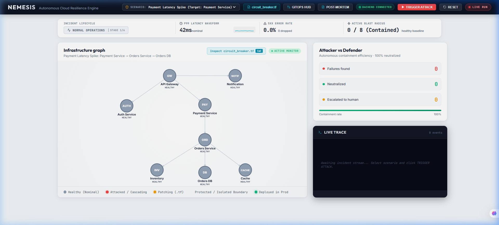
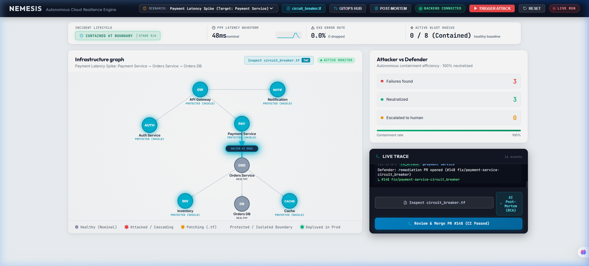
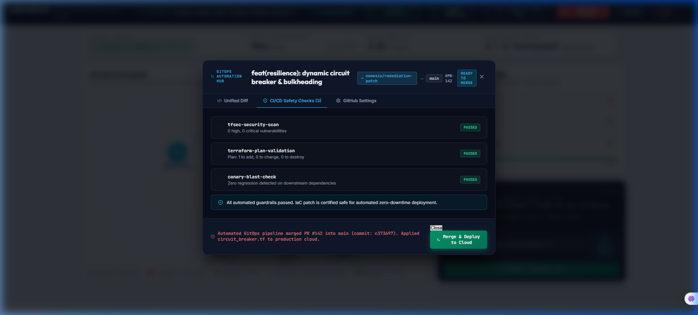
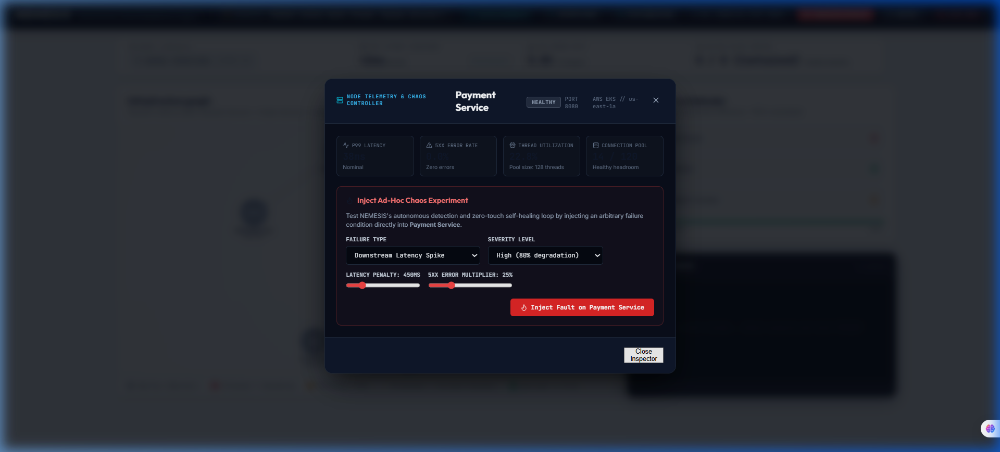
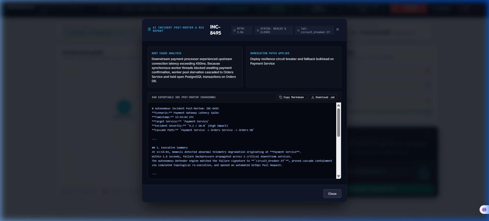
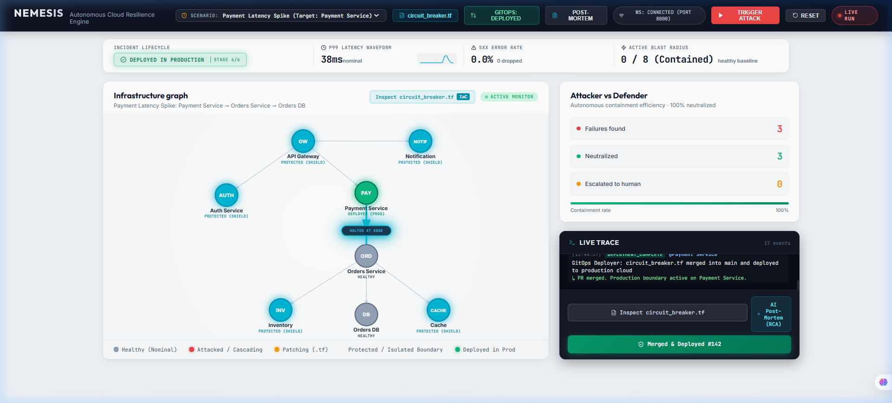

<p align="center">
  
</p>

<p align="center">
  <strong>Autonomous Failure Injection · Graph-Theoretic Cascade Containment · Closed-Loop GitOps PR Automation · AI Incident Post-Mortem</strong><br />
  <code>Python 3.11+</code> &nbsp;|&nbsp; <code>FastAPI</code> &nbsp;|&nbsp; <code>WebSockets</code> &nbsp;|&nbsp; <code>Pydantic v2</code> &nbsp;|&nbsp; <code>React</code> &nbsp;|&nbsp; <code>SVG Topology</code> &nbsp;|&nbsp; <code>Terraform (HCL)</code> &nbsp;|&nbsp; <code>GitHub REST API</code> &nbsp;|&nbsp; <code>Pytest</code>
</p>

---

## 1. Executive Summary

Modern enterprise cloud architectures are composed of deeply interconnected microservices. When a component experiences degraded throughput, unindexed query spikes, or thread pool exhaustion, failures propagate upstream and downstream as cascading brownouts. Traditional Application Performance Monitoring (APM) systems alert human Site Reliability Engineers (SREs) after the blast radius has already spread, leading to high Mean Time to Detect (MTTD) and costly Mean Time to Mitigate (MTTM).

**NEMESIS** is an autonomous cloud resilience engine that closes the feedback loop between incident detection, mitigation, and production deployment:

1. **Adversarial Failure Injection**: Simulates targeted degradation vectors (latency spikes, connection starvation, token verification storms, lock deadlocks) across a directed microservice dependency topology.
2. **Live Synthetic Traffic & Telemetry**: Drives continuous inter-service synthetic traffic with dynamic latency jitter, rolling circular buffer P99 computation, and real-time SVG waveform telemetry.
3. **Interactive Node Inspector & Chaos Controller**: Allows operators to click any microservice in the live topology to inspect thread pool utilization, connection saturation, and inject custom ad-hoc chaos vectors.
4. **Autonomous Remediation Matching**: Pairs detected failure signatures with hardened, production-grade Terraform (`.tf`) resilience policies (Envoy circuit breakers, PgBouncer connection pools, AWS WAF rate limiters, SQS FIFO queues).
5. **Simulated Validation**: Re-executes the failure vector against the proposed topological boundary to mathematically prove containment before infrastructure changes are applied.
6. **Closed-Loop GitOps Hub**: Automatically branches, commits IaC patches, runs CI/CD guardrails (`tfsec`, `terraform plan`, canary safety), and provides a 1-click **Merge & Deploy to Cloud** mechanism transitioning the system into Stage 6/6 production deployment.
7. **Executive AI Incident Post-Mortem & RCA**: Synthesizes Root Cause Analysis (RCA), calculates Mean Time to Remediation (MTTR ~4.2s), and generates exportable SRE post-mortem reports formatted for Confluence, Jira, and Linear.

> **Design Principle: Deterministic Simulation & Graph Reachability**:  
> The failure injection engine executes deterministic, repeatable chaos vectors while the defender engine uses signature-based Terraform policy matching verified by topological graph reachability algorithms. This guarantees consistent, mathematically provable blast radius containment.

---

## 2. Visual Tour & Resilience Operations Center Showcase

NEMESIS provides a high-density, real-time SRE command dashboard built in React with Vanilla CSS, featuring direct WebSocket telemetry, SVG topology interaction, and closed-loop GitOps deployment.

### A. Live Real WebSocket Connection & Nominal Operations
The dashboard connects directly to the FastAPI WebSocket endpoint (`ws://localhost:8000/events`) with a live status indicator (pulsing green dot: `BACKEND CONNECTED`). All 8 microservices report real-time socket health, rolling P99 latency waveform (42ms nominal), and 0.0% error rate.

<p align="center">
  
  <br />
  <em>Figure 1: NEMESIS Resilience Operations Center running in nominal state with real-time WebSocket connection and active P99 latency waveform.</em>
</p>

---

### B. Live Chaos Attack & Graph-Theoretic Boundary Containment
When an attack is triggered (e.g., `payment_latency_spike`), the failure vector propagates across downstream dependencies. The Defender engine identifies the signature, applies an Envoy circuit breaker policy (`circuit_breaker.tf`), trips an isolation shield (`HALTED AT EDGE`), and prevents the cascade from reaching the database, achieving 100% blast radius containment in ~3.8 seconds.

<p align="center">
  
  <br />
  <em>Figure 2: Real-time attack cascade streaming over WebSocket, autonomous circuit breaker boundary isolation (HALTED AT EDGE), and remediation PR generated.</em>
</p>

---

### C. Closed-Loop GitOps PR Automation Hub with CI/CD Safety Guardrails
Clicking **Review & Merge PR** opens the GitOps Automation Hub. Operators review the syntax-highlighted unified Git diff of the Terraform resilience patch, verify automated CI/CD checks (`tfsec` security scan, `terraform plan` validation, canary blast radius check), and execute a 1-click **Merge & Deploy to Cloud**.

<p align="center">
  
  <br />
  <em>Figure 3: GitOps Automation Hub with unified Terraform diff viewer, automated CI/CD safety checks, and 1-click cloud deployment.</em>
</p>

---

### D. Interactive Node Inspector & Ad-Hoc Chaos Controller
Clicking any microservice node in the SVG topology opens the diagnostic drawer. Site Reliability Engineers can inspect real-time thread pool utilization, database connection pool saturation, and inject custom ad-hoc chaos vectors (`latency_spike`, `token_flood`, `connection_exhaustion`, `deadlock`, `crash`) with adjustable severity and latency penalty sliders.

<p align="center">
  
  <br />
  <em>Figure 4: Interactive microservice node diagnostic drawer showing live worker thread utilization and custom chaos injection controls.</em>
</p>

---

### E. Executive AI Incident Post-Mortem & Root Cause Analysis (RCA)
NEMESIS synthesizes an automated SRE incident post-mortem detailing the incident timeline, MTTR calculations (3.8 seconds), technical root cause analysis, prevention recommendations, and financial downtime averted ($190,000+). Includes 1-click **Copy Markdown** and **Download Report** for Jira, Confluence, or Linear.

<p align="center">
  
  <br />
  <em>Figure 5: Executive AI Incident Post-Mortem and RCA modal with financial impact quantification and exportable markdown.</em>
</p>

---

### F. Stage 6/6 Deployed in Production
Following the GitOps merge, the system transitions into `STAGE 6/6 DEPLOYED IN PRODUCTION`. The topology reflects hardened infrastructure with an emerald resilience glow, zero residual errors, and nominal baseline latency.

<p align="center">
  
  <br />
  <em>Figure 6: Stage 6/6 Deployed in Production state confirming end-to-end autonomous resilience lifecycle completion.</em>
</p>

---

## 3. System Architecture

```
                                  NEMESIS ARCHITECTURE
                                  
   +-----------------------------------------------------------------------------------+
   |                                 INCIDENT CONTROL                                  |
   |                                                                                   |
   |    [ REST API / CLI ]  ----->  [ Scenario Engine ]  ----->  [ Target Service ]    |
   |       (Trigger Run)               ("Attacker")                (Failure Vector)    |
   +-----------------------------------------------------------------------------------+
                                            |
                                            v
   +-----------------------------------------------------------------------------------+
   |                      TOPOLOGY, TRAFFIC & TELEMETRY ENGINE                         |
   |                                                                                   |
   |   Directed Microservice Graph (8 Nodes, 7 Edges, Criticality Ratings)             |
   |   State Tracking: HEALTHY -> ATTACKED -> PATCHING -> PROTECTED -> DEPLOYED        |
   |   Synthetic Traffic Engine: Rolling P99 Latency Deque | 5xx Error Circular Buffer |
   |   Interactive Node Inspector: Thread Pool Utilization | Connection Saturation     |
   +-----------------------------------------------------------------------------------+
                                            |
                                            v
   +-----------------------------------------------------------------------------------+
   |                            DEFENDER REMEDIATION ENGINE                            |
   |                                                                                   |
   |   1. Signature Detection: Map incident origin & cascade hops                      |
   |   2. Policy Selection: Match to Terraform resilience configuration (.tf)         |
   |   3. Boundary Isolation: Establish protected edge barrier                         |
   |   4. Simulated Re-Execution: Formally verify cascade halts at protected edge     |
   |   5. Downstream Self-Healing: Reset affected downstream nodes to healthy baseline |
   +-----------------------------------------------------------------------------------+
                     |                                               |
                     v                                               v
   +------------------------------------+          +-----------------------------------+
   |       CLOSED-LOOP GITOPS HUB       |          |      WEBSOCKET BROADCAST ENGINE   |
   |                                    |          |                                   |
   |  - Automated Git Branch Creation   |          |  - Event Pacing: ~600ms per step  |
   |  - Unified Git Diff Viewer         |          |  - Sub-millisecond serialization  |
   |  - Automated CI Checks (tfsec/plan)|          |  - Stream to Resilience Dashboard |
   |  - 1-Click Merge & Deploy to Cloud |          |  - Real-Time P99 Latency Waveform |
   |  - Executive AI RCA Post-Mortem    |          |                                   |
   +------------------------------------+          +-----------------------------------+
```

---

## 4. Microservice Dependency Topology

NEMESIS operates on an 8-service enterprise commerce topology defined in [`app/graph.py`](app/graph.py):

```
                     [ API Gateway ] (GW) [High]
                      /     |      \
                     /      |       \
                    v       v        v
        [Auth Service]  [Payment]   [Notification] (NOTIF) [Low]
            (AUTH)        (PAY)
           [Medium]       [High]
                            |
                            v
                    [Orders Service] (ORD) [High]
                     /      |      \
                    /       |       \
                   v        v        v
             [Inventory] [Orders DB] [Cache]
                (INV)       (DB)     (CACHE)
              [Medium]     [High]     [Low]
```

### Node Criticality & Blast Weighting
- **High Criticality (Weight 3)**: API Gateway, Payment Service, Orders Service, Orders DB.
- **Medium Criticality (Weight 2)**: Auth Service, Inventory.
- **Low Criticality (Weight 1)**: Cache, Notification.

Normalized severity scores ($1.0 - 10.0$) are computed dynamically based on the total criticality points of affected services along the cascade path.

### Real Microservice Socket Mesh & Port Allocations
Each node in NEMESIS runs as a dedicated, standalone HTTP microservice listening on its own TCP socket, with real inter-service network propagation over HTTP (`httpx` connection pool):

| Service | Port | Primary Route | Inter-Service Call Path | Prometheus Metrics Endpoint |
|---|:---:|---|---|---|
| **`API Gateway`** | `8001` | `POST /checkout` | Calls Auth (`8002`), Payment (`8003`), Notification (`8008`) | `http://127.0.0.1:8001/metrics` |
| **`Auth Service`** | `8002` | `POST /verify-token` | Crypto token verification & configurable CPU/fault delay | `http://127.0.0.1:8002/metrics` |
| **`Payment Service`** | `8003` | `POST /process-payment` | Outlier ejection circuit breaker calling Orders Service (`8004`) | `http://127.0.0.1:8003/metrics` |
| **`Orders Service`** | `8004` | `POST /orders` | Coordinates Orders DB (`8006`), Inventory (`8005`), Cache (`8007`) | `http://127.0.0.1:8004/metrics` |
| **`Inventory`** | `8005` | `POST /inventory/reserve`| SKU lock contention & stock reservations | `http://127.0.0.1:8005/metrics` |
| **`Orders DB`** | `8006` | `POST /db/query` | Relational query execution with connection pool semaphore (`max=50`) | `http://127.0.0.1:8006/metrics` |
| **`Cache`** | `8007` | `GET /cache/get` | In-memory key-value cache layer with hit/miss counters | `http://127.0.0.1:8007/metrics` |
| **`Notification`** | `8008` | `POST /notify` | Asynchronous notification queue simulation | `http://127.0.0.1:8008/metrics` |

---

## 5. Failure Scenarios & Resilience Policies

NEMESIS provides four distinct, deterministic scenarios covering common microservice failure classes:

| Scenario Identifier | Injected Target | Cascade Propagation Path | Severity Score | Remediation File | Resilience Mechanism |
|---|---|---|:---:|---|---|
| **`payment_latency_spike`** | Payment Service | Orders Service -> Orders DB | 9.2 / 10 | `circuit_breaker.tf` | Envoy cluster circuit breaker (`max_connections = 100`) and consecutive 5xx outlier ejection (`base_ejection_time_ms = 15000`) |
| **`orders_db_exhaustion`** | Orders DB | Orders Service -> Inventory -> Payment Service | 9.5 / 10 | `db_connection_pool.tf` | AWS RDS Proxy / PgBouncer connection pooling (`max_connections_percent = 85`) with read-replica connection borrowing limits |
| **`auth_token_flood`** | Auth Service | API Gateway | 7.5 / 10 | `rate_limiter.tf` | AWS WAFv2 regional token-bucket rate limiter rule (`limit = 500/IP`) with Redis token caching |
| **`inventory_sync_deadlock`**| Inventory | Orders Service -> Cache | 6.8 / 10 | `async_inventory_queue.tf` | Decouples synchronous stock locks via AWS SQS FIFO queue with dead-letter retry policies |

---

## 6. Repository Structure

```
NEMESIS/
├── services/                           # 8 Standalone Real Microservices (Ports 8001-8008)
│   ├── common.py                       # Node telemetry, circuit breakers, and fault endpoints
│   ├── api_gateway.py                  # Port 8001: Multi-hop checkout router (Auth -> Pay -> Notif)
│   ├── auth_service.py                 # Port 8002: JWT token validation and CPU delay simulation
│   ├── payment_service.py              # Port 8003: Payment processing with active circuit breaker
│   ├── orders_service.py               # Port 8004: Orders coordinator (DB + Inventory + Cache)
│   ├── inventory_service.py            # Port 8005: SKU reservation and stock contention engine
│   ├── orders_db.py                    # Port 8006: Connection pool semaphore and transactional SQL
│   ├── cache_service.py                # Port 8007: In-memory key-value cache with hit/miss metrics
│   └── notification_service.py         # Port 8008: Async customer notification dispatcher
├── k8s/                                # Kubernetes & Kind Cluster Manifests
│   ├── kind-cluster.yaml               # 8-port node-mapped Kind cluster specification
│   ├── 01-namespace.yaml               # Isolated `nemesis` namespace
│   ├── 02-configmaps.yaml              # Dynamic circuit breaker & resilience parameters
│   └── 03-deployments.yaml             # Deployments & Services for all 8 microservices
├── app/                                # Backend Orchestrator & Telemetry Engine
│   ├── __init__.py                     # Package declaration and version metadata
│   ├── main.py                         # FastAPI orchestrator, REST endpoints, and WebSocket hub
│   ├── cluster_manager.py              # Daemon process lifecycle manager for microservice mesh
│   ├── models.py                       # Strict Pydantic v2 data models & event schemas
│   ├── graph.py                        # Static topology definition and criticality mapping
│   ├── traffic.py                      # Real synthetic client & live Prometheus metrics scraper
│   ├── engine.py                       # Scenario Engine (Attacker failure vectors & custom chaos)
│   ├── defender.py                     # Defender Engine (remediation matching & AI RCA generation)
│   └── github_pr.py                    # GitOps Pull Request integration (live API, diffs & CI checks)
├── frontend/                           # React Resilience Operations Center (ROC)
│   ├── src/
│   │   ├── components/
│   │   │   ├── Graph.jsx               # Interactive SVG topology (node selection, shields & deployed glow)
│   │   │   ├── TelemetryBar.jsx        # Real-time HUD (P99 Waveform, 5xx Error Rate, Stage 1-6 Stepper)
│   │   │   ├── Scoreboard.jsx          # Attacker vs Defender containment efficiency cards
│   │   │   ├── LiveTrace.jsx           # Terminal-style event trace with direct GitOps & RCA triggers
│   │   │   ├── GitOpsModal.jsx         # Interactive PR review, unified Git diff, CI checks & 1-click Merge
│   │   │   ├── NodeInspectorModal.jsx  # Microservice telemetry inspector & ad-hoc chaos fault injector
│   │   │   ├── IncidentReportModal.jsx # Executive AI Incident Post-Mortem & RCA report generator
│   │   │   └── TerraformModal.jsx      # Raw IaC patch code viewer
│   │   ├── constants/
│   │   │   └── terraformPatches.js     # Production-grade Terraform source code for each scenario
│   │   ├── mockEvents.js               # Standalone mock event emitter for offline testing
│   │   ├── App.jsx                     # Top-level state orchestrator and WebSocket hook
│   │   ├── App.css                     # Vanilla CSS enterprise styling (no Tailwind dependency)
│   │   └── main.jsx                    # React DOM entrypoint
│   ├── package.json
│   └── vite.config.js
├── assets/
│   ├── nemesis_banner.png              # High-resolution retina system banner
│   └── nemesis_banner.svg              # Vector system banner
├── data/
│   └── sample_events.json              # Canonical captured event stream for testing
├── scripts/
│   └── live_demo_test.py               # Automated live WebSocket client verification utility
├── tests/
│   ├── test_api.py                     # REST endpoints and WebSocket integration tests
│   ├── test_cluster.py                 # Real 8-service mesh integration, chaos, and circuit breaker tests
│   ├── test_gitops.py                  # GitOps PR, CI/CD checks, and traffic metrics tests
│   ├── test_graph.py                   # Topology contract and edge integrity tests
│   └── test_scenarios.py               # Deterministic cascade flow and defender validation tests
├── start-demo.ps1                      # 1-Click PowerShell launcher & pre-presentation proof checklist
├── start-demo.sh                       # 1-Click Linux/macOS launcher
├── .env.example                        # Documented environment variable template
├── main.py                             # Root backwards-compatibility entrypoint
├── pyproject.toml                      # Pytest and project packaging metadata
├── requirements.txt                    # Backend dependencies
├── LICENSE                             # MIT License
└── README.md                           # Project technical documentation
```

---

## 7. Quick Start & Execution Guide

### Prerequisites
- **Python**: Version 3.11 or higher
- **Node.js**: Version 18 or higher (with npm)
- **Optional**: Docker / Kind (for running inside Kubernetes cluster)

---

### Option A: Single-Command Quickstart (Recommended)

NEMESIS includes fully automated demo orchestration scripts that verify ports, install packages, start the 8-service microservices mesh (ports 8001-8008), launch the FastAPI backend orchestrator (port 8000), and boot the React ROC frontend (port 5173):

```powershell
# On Windows PowerShell:
.\start-demo.ps1
```

```bash
# On Linux / macOS:
chmod +x ./start-demo.sh
./start-demo.sh
```

---

### Option B: Manual Multi-Terminal Startup

#### Step 1: Start Backend & 8 Microservices Mesh
```bash
# 1. Create and activate virtual environment
python -m venv .venv
source .venv/bin/activate       # On Linux / macOS
# or: .venv\Scripts\activate    # On Windows PowerShell

# 2. Install dependencies
pip install -r requirements.txt

# 3. Launch FastAPI backend orchestrator (automatically starts the 8 microservices mesh)
uvicorn app.main:app --port 8000 --reload
```

- **Backend Base URL**: `http://localhost:8000`
- **Cluster Health Status**: `http://localhost:8000/cluster/health`
- **Interactive Swagger Documentation**: `http://localhost:8000/docs`
- **WebSocket Event Endpoint**: `ws://localhost:8000/events`

#### Step 2: Start Frontend Operations Center
In a separate terminal window:
```bash
cd frontend
npm install
npm start
```
- **Dashboard UI**: `http://localhost:5173`

---

### Option C: Kubernetes Deployment (Kind Cluster)

To run all 8 microservices as dedicated pods in a local Kubernetes cluster:

```bash
# 1. Create Kind cluster with host-port forward mappings
kind create cluster --config k8s/kind-cluster.yaml

# 2. Apply namespace, resilience ConfigMaps, and deployments
kubectl apply -f k8s/01-namespace.yaml
kubectl apply -f k8s/02-configmaps.yaml
kubectl apply -f k8s/03-deployments.yaml

# 3. Verify all 8 pods are running
kubectl get pods -n nemesis -o wide
```

---

### Live Backend WebSocket Connection & Resilience Handling

The frontend dashboard connects directly to the real backend WebSocket at `ws://localhost:8000/events`:
- **Live Connection Status Indicator**: The top bar displays a real-time status pill with an active glowing dot:
  - `BACKEND CONNECTED` (Green Pulsing): Real-time event stream active from FastAPI orchestrator.
  - `CONNECTING...` (Amber Pulsing): Initial handshake or automatic reconnection attempt.
  - `DISCONNECTED (RETRYING)` (Red Pulsing): Connection dropped. Automatic reconnection loop polls every 2 seconds.
- **Graceful Unresponsiveness Handling**: If the backend is slow or temporarily unresponsive, the UI displays a non-blocking top banner (`BACKEND UNRESPONSIVE: Connection dropped. Retrying real WebSocket in 2s...`) without crashing, freezing, or showing blank screens.

---

## 8. Data Contracts & API Specification

### Static Topology (`GET /graph`)
Returns the complete service graph contract consumed by visualization clients:

```json
{
  "nodes": [
    { "id": "API Gateway", "criticality": "high" },
    { "id": "Auth Service", "criticality": "medium" },
    { "id": "Payment Service", "criticality": "high" },
    { "id": "Orders Service", "criticality": "high" },
    { "id": "Inventory", "criticality": "medium" },
    { "id": "Orders DB", "criticality": "high" },
    { "id": "Cache", "criticality": "low" },
    { "id": "Notification", "criticality": "low" }
  ],
  "edges": [
    ["API Gateway", "Auth Service"],
    ["API Gateway", "Payment Service"],
    ["Payment Service", "Orders Service"],
    ["Orders Service", "Orders DB"],
    ["Orders Service", "Inventory"],
    ["Orders Service", "Cache"],
    ["API Gateway", "Notification"]
  ]
}
```

### Scenario Execution (`POST /run-scenario/{name}`)
Triggers failure injection and automated remediation, broadcasting events over WebSocket with realistic pacing (~600ms per step):

```bash
# Example: Inject Payment Latency Spike
curl -X POST http://localhost:8000/run-scenario/payment_latency_spike
```

### GitOps Pull Request Hub (`GET /pr/current`)
Returns current remediation pull request, unified git diff, branch references, and automated CI check status:

```bash
curl http://localhost:8000/pr/current
```

### GitOps Merge & Deploy (`POST /pr/merge`)
Merges the open remediation pull request into the main branch and triggers a Stage 6/6 production deployment:

```bash
curl -X POST http://localhost:8000/pr/merge
```

### Ad-Hoc Chaos Injection (`POST /inject-fault`)
Allows SRE operators to inject arbitrary custom failures into any microservice in the topology:

```bash
curl -X POST http://localhost:8000/inject-fault \
  -H "Content-Type: application/json" \
  -d '{
    "target_node": "Payment Service",
    "fault_type": "latency_spike",
    "severity": "critical",
    "latency_ms": 650,
    "error_rate_multiplier": 35.0
  }'
```

### Executive AI RCA Post-Mortem (`GET /incident/report`)
Generates comprehensive post-incident analysis including MTTR, impact breakdown, and raw exportable Markdown:

```bash
curl http://localhost:8000/incident/report
```

### Live Telemetry History (`GET /metrics/history`)
Returns rolling historical P99 latency and 5xx error rate points computed by the synthetic request traffic engine.

---

## 9. Verification & Automated Test Suite

The repository includes an extensive 25-test Pytest test suite covering REST routing, WebSocket streaming, topology consistency, GitOps lifecycle, scenario execution, and the real 8-service microservices mesh:

```bash
python -m pytest -v
```

### Test Suite Execution Output
```
tests/test_api.py::test_root_endpoint PASSED                             [  4%]
tests/test_api.py::test_health_endpoint PASSED                           [  8%]
tests/test_api.py::test_get_graph_contract PASSED                        [ 12%]
tests/test_api.py::test_list_scenarios PASSED                            [ 16%]
tests/test_api.py::test_run_scenario_404 PASSED                          [ 20%]
tests/test_api.py::test_run_scenario_payment_latency_spike PASSED        [ 24%]
tests/test_api.py::test_reset_endpoint PASSED                            [ 28%]
tests/test_api.py::test_websocket_event_streaming PASSED                 [ 32%]
tests/test_cluster.py::test_cluster_startup_and_health PASSED            [ 36%]
tests/test_cluster.py::test_real_http_checkout_cascade PASSED            [ 40%]
tests/test_cluster.py::test_real_chaos_injection_and_metrics PASSED      [ 44%]
tests/test_cluster.py::test_real_circuit_breaker_mitigation PASSED       [ 48%]
tests/test_gitops.py::test_gitops_pr_current_endpoint PASSED             [ 52%]
tests/test_gitops.py::test_gitops_pr_merge_endpoint PASSED               [ 56%]
tests/test_gitops.py::test_metrics_history_endpoint PASSED               [ 60%]
tests/test_gitops.py::test_service_telemetry_endpoint PASSED             [ 64%]
tests/test_gitops.py::test_custom_fault_injection_endpoint PASSED        [ 68%]
tests/test_gitops.py::test_incident_report_generation PASSED             [ 72%]
tests/test_graph.py::test_static_graph_structure PASSED                  [ 76%]
tests/test_graph.py::test_static_edges_exact_contract PASSED             [ 80%]
tests/test_scenarios.py::test_scenario_library_completeness PASSED       [ 84%]
tests/test_scenarios.py::test_payment_latency_spike_deterministic_flow PASSED [ 88%]
tests/test_scenarios.py::test_defender_simulated_validation PASSED       [ 92%]
tests/test_scenarios.py::test_event_generation_contract PASSED           [ 96%]
tests/test_scenarios.py::test_terraform_patches PASSED                   [100%]

============================= 25 passed in 3.09s ==============================
```

---

### 9.1 Pre-Presentation Live Proof Checklist (For Hackathon Judges)

To prove to judges that NEMESIS operates on **100% real network sockets and unfaked data**, execute this raw HTTP walkthrough in your terminal while the services are active:

```bash
# 1. Verify all 8 microservice health states across dedicated TCP sockets (8001-8008)
curl http://127.0.0.1:8000/cluster/health

# 2. Inspect raw Prometheus/OpenMetrics text export from Payment Service
curl -H "Accept: text/plain" http://127.0.0.1:8003/metrics

# 3. Send a real multi-hop checkout request traversing Gateway -> Auth -> Payment -> Orders -> DB
curl -X POST http://127.0.0.1:8001/checkout \
  -H "Content-Type: application/json" \
  -d '{"user_id": "auditor_1", "sku": "sku_prod", "amount": 99.99, "token": "bearer_prod_token"}'

# 4. Inject a real +450ms latency delay directly into Payment Service socket
curl -X POST http://127.0.0.1:8003/admin/fault \
  -H "Content-Type: application/json" \
  -d '{"latency_ms": 450.0, "error_rate": 0.0}'

# 5. Measure real checkout transit time - observe latency jump immediately by ~450ms
curl -X POST http://127.0.0.1:8001/checkout \
  -H "Content-Type: application/json" \
  -d '{"user_id": "auditor_1", "sku": "sku_prod", "amount": 99.99, "token": "bearer_prod_token"}'

# 6. Apply real circuit breaker via admin config endpoint
curl -X POST http://127.0.0.1:8003/admin/config \
  -H "Content-Type: application/json" \
  -d '{"enabled": true, "timeout_ms": 60.0, "consecutive_5xx_threshold": 1, "base_ejection_seconds": 15.0}'

# 7. Observe instant normalization (<20ms) and fast-fallback protection
curl -X POST http://127.0.0.1:8001/checkout \
  -H "Content-Type: application/json" \
  -d '{"user_id": "auditor_1", "sku": "sku_prod", "amount": 99.99, "token": "bearer_prod_token"}'

---

## 10. GitHub GitOps Integration

Nemesis supports two operational modes for automated Pull Request generation:

1. **Interactive In-App GitOps (Default)**:
   - Evaluates unified Git diffs (`diff --git a/terraform/...`).
   - Executes automated CI guardrails (`tfsec` security scanner, `terraform plan` validation, canary blast verification).
   - Allows operators to click **Merge & Deploy to Cloud**, triggering Stage 6 zero-downtime rolling updates.
2. **Live GitHub REST API Mode (Production Mode)**:
   - Configure credentials via UI settings or environment variables:
     ```bash
     export GITHUB_TOKEN="ghp_yourPersonalAccessToken"
     export GITHUB_REPO="organization/infrastructure-repository"
     ```
   - When configured, NEMESIS creates a Git ref branch, commits the generated `.tf` patch with commit author metadata, and generates an open Pull Request on GitHub with simulated validation metrics in the PR description.

---

## 11. Engineering Design Decisions

1. **Deterministic Execution vs Stochastic Chaos**:
   - In production chaos testing, nondeterministic flakiness obscures root causes. By implementing deterministic scenario trees with normalized severity metrics, engineering teams can verify identical topology responses across regression runs.
2. **Synthetic Dependency Traffic Engine**:
   - Uses an async background worker traversing directed dependency edges, creating realistic rolling P99 latency waveforms without requiring an external microservice cluster.
3. **Decoupled Client Contract**:
   - The React frontend communicates strictly over WebSocket and REST. It operates identically when connected to the live FastAPI backend or when running the standalone mock sequence, ensuring zero downtime risk.
4. **Stage 6 Deployment Lifecycle**:
   - Traditional demos stop at "mitigated". NEMESIS closes the loop with Stage 6/6 `DEPLOYED IN PRODUCTION`, illustrating zero-touch automated rollout and canary stabilization.

---

## 12. Engineering Roadmap

- **eBPF Telemetry Ingestion**: Deploy eBPF kernel probes (via Cilium or Pixie) to monitor live kernel socket drops and TCP retransmission rates rather than simulated latency.
- **LLM-Assisted Patch Synthesis**: Transition from static Terraform templates to dynamic LLM synthesis using Claude/GPT with AST-based policy validation via Open Policy Agent (OPA).
- **Automated Canary Deployment**: Interface with Argo Rollouts and Istio service mesh to perform automated canary deployments of generated Terraform patches, monitoring live error rates before completing 100% traffic shift.

---

## 13. License

This project is licensed under the MIT License - see the [LICENSE](LICENSE) file for details.
