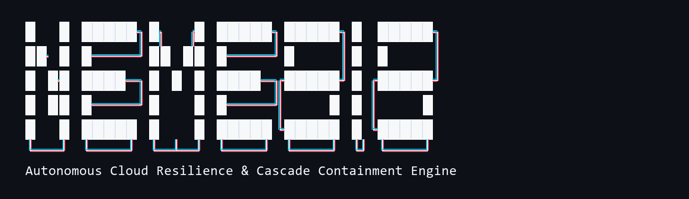

<p align="center">
  
</p>

<p align="center">
  <strong>Autonomous Failure Injection · Graph-Theoretic Cascade Containment · Automated IaC Remediation</strong><br />
  <code>Python 3.11+</code> &nbsp;|&nbsp; <code>FastAPI</code> &nbsp;|&nbsp; <code>WebSockets</code> &nbsp;|&nbsp; <code>Pydantic v2</code> &nbsp;|&nbsp; <code>React</code> &nbsp;|&nbsp; <code>SVG Topology</code> &nbsp;|&nbsp; <code>Terraform (HCL)</code> &nbsp;|&nbsp; <code>Pytest</code>
</p>

---

## 1. Executive Summary

Modern enterprise cloud architectures are composed of deeply interconnected microservices. When a component experiences degraded throughput, unindexed query spikes, or thread pool exhaustion, failures propagate upstream and downstream as cascading brownouts. Traditional Application Performance Monitoring (APM) systems alert human Site Reliability Engineers (SREs) after the blast radius has already spread, leading to high Mean Time to Detect (MTTD) and costly Mean Time to Mitigate (MTTM).

**NEMESIS** is an autonomous cloud resilience engine designed to close the feedback loop between incident detection and remediation:

1. **Adversarial Failure Injection**: Simulates targeted degradation vectors (latency spikes, connection starvation, token verification storms, lock deadlocks) across a directed microservice dependency topology.
2. **Blast Radius Tracking**: Quantifies real-time cascading failure propagation, tracking P99 latency degradation, 5xx error rate spikes, and compromised service reachability.
3. **Autonomous Remediation Matching**: Pairs detected failure signatures with hardened, production-grade Terraform (`.tf`) resilience policies (Envoy circuit breakers, PgBouncer connection pools, AWS WAF rate limiters, SQS FIFO queues).
4. **Simulated Validation**: Re-executes the failure vector against the proposed topological boundary to mathematically prove containment before infrastructure changes are applied.
5. **Automated GitOps Remediation**: Generates branch commits and Pull Requests with formal verification proofs attached, eliminating manual patch authoring during active incidents.

> **Design Principle: Deterministic Simulation & Graph Reachability**:  
> The failure injection engine executes deterministic, repeatable chaos vectors while the defender engine uses signature-based Terraform policy matching verified by topological graph reachability algorithms. This guarantees consistent, mathematically provable blast radius containment.

---

## 2. System Architecture

```
                                  NEMESIS ARCHITECTURE
                                  
   +-----------------------------------------------------------------------------------+
   |                                 INCIDENT CONTROL                                  |
   |                                                                                   |
   |    [ REST API / CLI ]  ----->  [ Scenario Engine ]  ----->  [ Target Service ]    |
   |       (Trigger Run)               ("Attacker")                (Failure Vector)    |
   +-----------------------------------------------------------------------------------+
                                            |
                                            v
   +-----------------------------------------------------------------------------------+
   |                            TOPOLOGY & TELEMETRY ENGINE                            |
   |                                                                                   |
   |   Directed Microservice Graph (8 Nodes, 7 Edges, Criticality Ratings)             |
   |   State Tracking: HEALTHY -> ATTACKED -> PATCHING -> PROTECTED                    |
   |   Quantitative Metrics: P99 Latency (ms) | 5xx Error Rate (%) | Blast Radius (N/8)  |
   +-----------------------------------------------------------------------------------+
                                            |
                                            v
   +-----------------------------------------------------------------------------------+
   |                            DEFENDER REMEDIATION ENGINE                            |
   |                                                                                   |
   |   1. Signature Detection: Map incident origin & cascade hops                      |
   |   2. Policy Selection: Match to Terraform resilience configuration (.tf)         |
   |   3. Boundary Isolation: Establish protected edge barrier                         |
   |   4. Simulated Re-Execution: Formally verify cascade halts at protected edge     |
   |   5. Downstream Self-Healing: Reset affected downstream nodes to healthy baseline |
   +-----------------------------------------------------------------------------------+
                     |                                               |
                     v                                               v
   +------------------------------------+          +-----------------------------------+
   |         GITOPS PR ENGINE           |          |      WEBSOCKET BROADCAST ENGINE   |
   |                                    |          |                                   |
   |  - Automated Git Branch Creation   |          |  - Event Pacing: ~600ms per step  |
   |  - Terraform Patch Commit (.tf)    |          |  - Sub-millisecond serialization  |
   |  - PR Generation (Offline / API)   |          |  - Stream to Resilience Dashboard |
   +------------------------------------+          +-----------------------------------+
```

---

## 3. Microservice Dependency Topology

NEMESIS operates on an 8-service enterprise commerce topology defined in [`app/graph.py`](app/graph.py):

```
                     [ API Gateway ] (GW) [High]
                      /     |      \
                     /      |       \
                    v       v        v
        [Auth Service]  [Payment]   [Notification] (NOTIF) [Low]
            (AUTH)        (PAY)
           [Medium]       [High]
                            |
                            v
                    [Orders Service] (ORD) [High]
                     /      |      \
                    /       |       \
                   v        v        v
             [Inventory] [Orders DB] [Cache]
                (INV)       (DB)     (CACHE)
              [Medium]     [High]     [Low]
```

### Node Criticality & Blast Weighting
- **High Criticality (Weight 3)**: API Gateway, Payment Service, Orders Service, Orders DB.
- **Medium Criticality (Weight 2)**: Auth Service, Inventory.
- **Low Criticality (Weight 1)**: Cache, Notification.

Normalized severity scores ($1.0 - 10.0$) are computed dynamically based on the total criticality points of affected services along the cascade path.

---

## 4. Failure Scenarios & Resilience Policies

NEMESIS provides four distinct, deterministic scenarios covering common microservice failure classes:

| Scenario Identifier | Injected Target | Cascade Propagation Path | Severity Score | Remediation File | Resilience Mechanism |
|---|---|---|:---:|---|---|
| **`payment_latency_spike`** | Payment Service | Orders Service -> Orders DB | 9.2 / 10 | `circuit_breaker.tf` | Envoy cluster circuit breaker (`max_connections = 100`) and consecutive 5xx outlier ejection (`base_ejection_time_ms = 15000`) |
| **`orders_db_exhaustion`** | Orders DB | Orders Service -> Inventory -> Payment Service | 9.5 / 10 | `db_connection_pool.tf` | AWS RDS Proxy / PgBouncer connection pooling (`max_connections_percent = 85`) with read-replica connection borrowing limits |
| **`auth_token_flood`** | Auth Service | API Gateway | 7.5 / 10 | `rate_limiter.tf` | AWS WAFv2 regional token-bucket rate limiter rule (`limit = 500/IP`) with Redis token caching |
| **`inventory_sync_deadlock`**| Inventory | Orders Service -> Cache | 6.8 / 10 | `async_inventory_queue.tf` | Decouples synchronous stock locks via AWS SQS FIFO queue with dead-letter retry policies |

---

## 5. Repository Structure

```
NEMESIS/
├── app/                                # Core backend service package
│   ├── __init__.py                     # Package declaration and version metadata
│   ├── main.py                         # FastAPI application, REST endpoints, and WebSocket manager
│   ├── models.py                       # Strict Pydantic v2 data models & schemas
│   ├── graph.py                        # Static topology definition and criticality mapping
│   ├── engine.py                       # Scenario Engine (Attacker failure vectors)
│   ├── defender.py                     # Defender Engine (remediation matching & simulated validation)
│   └── github_pr.py                    # GitOps Pull Request integration (offline stub & live API)
├── frontend/                           # React Resilience Operations Center (ROC)
│   ├── src/
│   │   ├── components/
│   │   │   ├── Graph.jsx               # SVG topology with animated cascade packets & boundary badges
│   │   │   ├── TelemetryBar.jsx        # Real-time HUD (P99 Latency, 5xx Error Rate, Blast Radius)
│   │   │   ├── Scoreboard.jsx          # Attacker vs Defender containment efficiency cards
│   │   │   ├── LiveTrace.jsx           # Terminal-style live event log with dynamic PR actions
│   │   │   └── TerraformModal.jsx      # Interactive IaC patch inspector with syntax formatting
│   │   ├── constants/
│   │   │   └── terraformPatches.js     # Production-grade Terraform source code for each scenario
│   │   ├── mockEvents.js               # Standalone mock event emitter for offline testing
│   │   ├── App.jsx                     # Top-level state orchestrator and WebSocket hook
│   │   ├── App.css                     # Vanilla CSS enterprise styling (no Tailwind dependency)
│   │   └── main.jsx                    # React DOM entrypoint
│   ├── package.json
│   └── vite.config.js
├── assets/
│   ├── nemesis_banner.png              # High-resolution retina system banner
│   └── nemesis_banner.svg              # Vector system banner
├── data/
│   └── sample_events.json              # Canonical captured event stream for testing
├── scripts/
│   └── live_demo_test.py               # Automated live WebSocket client verification utility
├── tests/
│   ├── test_api.py                     # REST endpoints and WebSocket integration tests
│   ├── test_graph.py                   # Topology contract and edge integrity tests
│   └── test_scenarios.py               # Deterministic cascade flow and defender validation tests
├── main.py                             # Root backwards-compatibility entrypoint
├── pyproject.toml                      # Pytest and project packaging metadata
├── requirements.txt                    # Backend dependencies
└── README.md                           # Project technical documentation
```

---

## 6. Quick Start & Execution Guide

### Prerequisites
- **Python**: Version 3.11 or higher
- **Node.js**: Version 18 or higher (with npm)

---

### Step 1: Start the Backend Service

```bash
# 1. Create and activate a virtual environment
python -m venv .venv
source .venv/bin/activate       # On Linux / macOS
# or: .venv\Scripts\activate    # On Windows PowerShell

# 2. Install dependencies
pip install -r requirements.txt

# 3. Launch the FastAPI server
uvicorn app.main:app --port 8000 --reload
```

- **Backend Base URL**: `http://localhost:8000`
- **Interactive Swagger Documentation**: `http://localhost:8000/docs`
- **WebSocket Event Endpoint**: `ws://localhost:8000/events`

---

### Step 2: Start the Frontend Operations Center

In a separate terminal window:

```bash
# 1. Navigate to frontend directory
cd frontend

# 2. Install dependencies
npm install

# 3. Start the Vite development server
npm start
```

- **Dashboard UI**: `http://localhost:5173`

---

### Step 3: Standalone vs Live Backend Toggle

The frontend is architected to support both **standalone simulation mode** (using built-in mock sequences for isolated testing) and **live backend streaming** (connecting to the FastAPI WebSocket):

- **In the UI**: Click the stream mode button in the top bar (`STREAM: MOCK EMITTER` $\leftrightarrow$ `WS: CONNECTED`).
- **In Code**: Set `USE_MOCK_STREAM_DEFAULT = false` in [`frontend/src/App.jsx`](frontend/src/App.jsx#L14) to default to the live WebSocket connection on page load.

---

## 7. Data Contracts & API Specification

### Static Topology (`GET /graph`)
Returns the complete service graph contract consumed by visualization clients:

```json
{
  "nodes": [
    { "id": "API Gateway", "criticality": "high" },
    { "id": "Auth Service", "criticality": "medium" },
    { "id": "Payment Service", "criticality": "high" },
    { "id": "Orders Service", "criticality": "high" },
    { "id": "Inventory", "criticality": "medium" },
    { "id": "Orders DB", "criticality": "high" },
    { "id": "Cache", "criticality": "low" },
    { "id": "Notification", "criticality": "low" }
  ],
  "edges": [
    ["API Gateway", "Auth Service"],
    ["API Gateway", "Payment Service"],
    ["Payment Service", "Orders Service"],
    ["Orders Service", "Orders DB"],
    ["Orders Service", "Inventory"],
    ["Orders Service", "Cache"],
    ["API Gateway", "Notification"]
  ]
}
```

### Scenario Execution (`POST /run-scenario/{name}`)
Triggers failure injection and automated remediation, broadcasting events over WebSocket with realistic pacing (~600ms per step):

```bash
# Example: Inject Payment Latency Spike
curl -X POST http://localhost:8000/run-scenario/payment_latency_spike
```

### Topology Reset (`POST /reset`)
Restores all services and edges to normal nominal health:

```bash
curl -X POST http://localhost:8000/reset
```

### WebSocket Event Protocol (`WS /events`)
Every broadcast message follows a strict Pydantic event schema:

```typescript
interface ResilienceEvent {
  type: "attack_start" | "cascade" | "defender_fix" | "simulation_result" | "pr_opened";
  timestamp: string;      // Format: "HH:MM:SS"
  service: string;        // Target node identifier
  message: string;        // Human-readable operational description
  detail: string;         // Diagnostic context or patch reference
  pr_url?: string;        // Pull request URL (if pr_opened)
  graph_delta?: {
    node: string;
    state: "healthy" | "attacked" | "patching" | "protected";
  };
}
```

---

## 8. Verification & Automated Test Suite

The repository includes a comprehensive Pytest test suite covering REST routing, WebSocket streaming, topology consistency, and scenario execution:

```bash
python -m pytest -v
```

### Test Suite Execution Output
```
tests/test_api.py::test_root_endpoint PASSED                           [  6%]
tests/test_api.py::test_health_endpoint PASSED                         [ 13%]
tests/test_api.py::test_get_graph_contract PASSED                      [ 20%]
tests/test_api.py::test_list_scenarios PASSED                          [ 26%]
tests/test_api.py::test_run_scenario_404 PASSED                        [ 33%]
tests/test_api.py::test_run_scenario_payment_latency_spike PASSED      [ 40%]
tests/test_api.py::test_reset_endpoint PASSED                          [ 46%]
tests/test_api.py::test_websocket_event_streaming PASSED               [ 53%]
tests/test_graph.py::test_static_graph_structure PASSED                [ 60%]
tests/test_graph.py::test_static_edges_exact_contract PASSED           [ 66%]
tests/test_scenarios.py::test_scenario_library_completeness PASSED     [ 73%]
tests/test_scenarios.py::test_payment_latency_spike_deterministic_flow PASSED [ 80%]
tests/test_scenarios.py::test_defender_simulated_validation PASSED     [ 86%]
tests/test_scenarios.py::test_event_generation_contract PASSED         [ 93%]
tests/test_scenarios.py::test_terraform_patches PASSED                 [100%]

============================= 15 passed in 2.34s ==============================
```

---

## 9. GitHub GitOps Integration

Nemesis supports two operational modes for automated Pull Request generation:

1. **Offline Mode (Default)**:
   - Formats deterministic, realistic PR references (e.g. `#142 fix/payment-service-circuit_breaker`).
   - Links to realistic branch URLs without requiring internet connectivity or personal access tokens.
2. **Live GitHub API Mode (Optional Production Mode)**:
   - Set environment variables prior to running:
     ```bash
     export GITHUB_TOKEN="ghp_yourPersonalAccessToken"
     export GITHUB_REPO="organization/infrastructure-repository"
     ```
   - When configured, NEMESIS creates a Git ref branch, commits the generated `.tf` patch with commit author metadata, and generates an open Pull Request on GitHub with simulated validation metrics in the PR description.

---

## 10. Engineering Design Decisions

1. **Deterministic Execution vs Stochastic Chaos**:
   - In production chaos testing, nondeterministic flakiness obscures root causes. By implementing deterministic scenario trees with normalized severity metrics, engineering teams can verify identical topology responses across regression runs.
2. **In-Memory Topology State**:
   - Avoids external database dependencies (e.g. PostgreSQL or Redis) for the prototype layer, ensuring single-command setup on any workstation.
3. **Decoupled Client Contract**:
   - The React frontend communicates strictly over WebSocket and REST. It operates identically when connected to the live FastAPI backend or when running the standalone mock sequence, ensuring zero downtime risk.
4. **Autonomous Self-Healing Visualization**:
   - When a boundary is isolated, downstream nodes naturally recover. The frontend dynamically simulates this recovery by resetting downstream services to nominal state upon containment confirmation, accurately representing backpressure relief.

---

## 11. Engineering Roadmap

- **eBPF Telemetry Ingestion**: Deploy eBPF kernel probes (via Cilium or Pixie) to monitor live kernel socket drops and TCP retransmission rates rather than simulated latency.
- **LLM-Assisted Patch Synthesis**: Transition from static Terraform templates to dynamic LLM synthesis using Claude/GPT with AST-based policy validation via Open Policy Agent (OPA).
- **Automated Canary Deployment**: Interface with Argo Rollouts and Istio service mesh to perform automated canary deployments of generated Terraform patches, monitoring live error rates before completing 100% traffic shift.

---

## 12. License

This project is licensed under the MIT License - see the [LICENSE](LICENSE) file for details.

